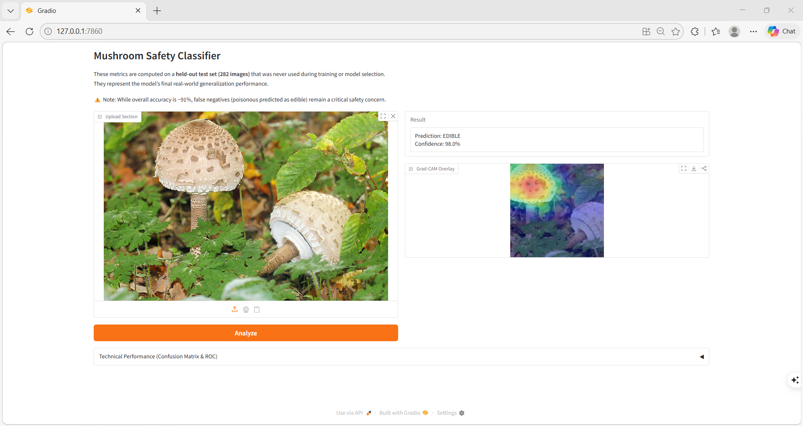
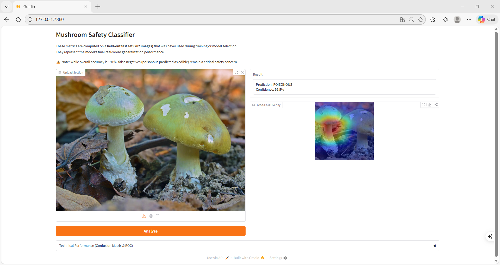

# Mushroom Classification — Edible vs. Poisonous

## Deep Learning with Transfer Learning (ResNet18)

---

### Interactive Web Demo
I have developed a local web interface using **Gradio**. 
To run the demo and classify your own images:
1. Navigate to the `src/` folder.
2. Run `python app.py`.
3. The interface provides:
   * **Real-time Prediction** (Edible/Poisonous)
   * **Confidence Scores**
   * **Grad-CAM Visualizations** (Model Interpretability)

---

## Demo Screenshot

<p align="center">
  
</p>

<p align="center">
  
</p>

---

### Model Performance Summary
The final model was selected based on the best validation epoch and evaluated on a held-out test set.

| Metric | Validation (Best Epoch) | Test (Final Evaluation) |
| :--- | :--- | :--- |
| **Accuracy** | 95.0% | 91.1% |
| **Poisonous Recall** | 94.2% | 86.4% |
| **ROC AUC** | 0.98 | 0.97 |

> **Note on Safety:** While accuracy is high, the model still carries a ~13.6% false negative rate for poisonous mushrooms. This highlights the importance of **Threshold Tuning** for safety-critical applications.

---

### Interpretability (Grad-CAM)
We utilize **Grad-CAM** to ensure the model focuses on mycological features (gills, cap, stem) rather than background noise. This step is crucial for verifying that the model is learning biological patterns.

---

### Problem Statement
Can we automatically classify mushroom images as edible or poisonous using deep convolutional neural networks, achieving at least **85% validation accuracy**, while minimizing dangerous false negatives?

---

### Critical Safety Disclaimer
**This project is for educational and research purposes only.**
**The model must NOT be used to determine whether a real mushroom is safe to eat.**

Even with **~91% test accuracy**:
* The model still produces **false negatives** (poisonous predicted as edible).
* Some errors occur with **high confidence (>90%)**.
* The dataset does not cover all mushroom species.
* Real-world lighting and unseen species may significantly degrade performance.
* **Mushroom foraging decisions should always be verified by trained experts.**

---

### Business & Real-World Relevance
Incorrect mushroom identification can result in severe poisoning and fatalities. An image classifier could potentially assist in:
* **Educational tools**
* **Foraging awareness apps**
* **Emergency triage support systems**

However, **safety-aware evaluation is essential** — minimizing false negatives is more important than maximizing overall accuracy.

---

### Dataset
**Course-provided mushroom image dataset**
* **Two classes:** edible, poisonous
* **Pre-split into:**
    * **Train:** 2,256 images
    * **Validation:** 282 images
    * **Test:** 282 images
* **Balanced classes**
* Natural outdoor lighting, varied angles, cluttered backgrounds

---

### Methods

#### Baseline CNN
* 3 Conv–BatchNorm–ReLU–MaxPool blocks
* Fully connected classifier
* 128×128 input resolution
* **Result: ~74% validation accuracy**
* Demonstrates the task is learnable.

#### Transfer Learning — ResNet18
* **Architecture:**
    * Pretrained **ResNet-18**
    * ImageNet weights
* **Custom head:**
    * **Dropout -> Linear(512->256) -> ReLU -> Dropout -> Linear(256->2)**
* **Two-phase training:**
    * **Phase A — Frozen Backbone:** Train classifier head only. Fast convergence. Stable learning.
    * **Phase B — Fine-tuning:** Unfreeze **layer4**.
    * **Differential learning rates:** Backbone: **1e-4**, Head: **1e-3**. Prevents catastrophic forgetting.

---

### Results

#### Baseline CNN
* **Best validation accuracy: 74.1%**

#### ResNet18 Transfer Learning
* **Best validation accuracy: 95.0%**
* **Test accuracy: 90.8–91%**
* **ROC AUC (poisonous class): 0.97**

#### Test Classification Report
| Class | Precision | Recall |
| :--- | :--- | :--- |
| **Edible** | 0.89 | 0.95 |
| **Poisonous** | 0.93 | 0.86 |

---

### Critical Failure Analysis
**Test set errors:**
* **26 total misclassifications (9.2%)**
* **18 false negatives** (poisonous -> edible)
* **8 false positives** (edible -> poisonous)

**Poisonous Recall: 86.4%**
This means **~14% of poisonous mushrooms were incorrectly predicted as edible.** This is unacceptable for real-world deployment.

---

### Safety-Oriented Threshold Tuning
Instead of using default threshold (**0.5**), we optimized for **>=95% recall** on poisonous mushrooms.
* **Result:** Threshold **~ 0.011**
* **Poisonous recall: 96.2%**
* **Precision: 77.4%**
This significantly reduces dangerous misses but increases false positives. This demonstrates **risk-aware model calibration.**

---

### Grad-CAM — Model Interpretability
To understand why the model predicts poisonous vs edible, we applied **Grad-CAM (Gradient-weighted Class Activation Mapping).**

Grad-CAM highlights image regions most responsible for the prediction.

**Findings:**
The model often focuses on:
* **Gills**
* **Cap texture**
* **Stem shape**

Some false negatives occur when:
* Background dominates attention
* Lighting reduces texture visibility
* Occlusions obscure key features

Grad-CAM confirms the model is not purely memorizing backgrounds, but also reveals failure modes.

---

### Evaluation Visualizations
* Class distribution bar plots
* Training curves (with fine-tuning marker)
* **Confusion matrices (validation + test)**
* **ROC curve (AUC = 0.97)**
* Precision–Recall vs threshold
* **Misclassification grids (dangerous errors highlighted in red)**
* Confidence histograms (correct vs wrong)
* **Grad-CAM heatmaps**

---

### 🛠️ How to Use
1. **Environment:** `conda activate mushroom_311`
2. **Training:** Run `notebooks/00_mushroom_cnn.ipynb`
3. **Inference / Web Demo:** Run `python src/app.py`

---

### Lessons Learned
* **Transfer learning** dramatically improves performance on small datasets.
* **Differential learning rates** protect pretrained features.
* **High accuracy does not equal safe deployment.**
* **Threshold tuning** is essential in safety-critical systems.
* Interpretability tools like **Grad-CAM** expose hidden model behavior.

---

### Limitations
* Limited species diversity
* No **out-of-distribution detection**
* Some high-confidence errors remain
* Not validated on real-world user photos
* **Not medically safe for deployment**

---

### Future Improvements
* Add **"unknown species"** class
* Use **focal loss** to penalize false negatives
* Probability calibration
* Ensemble models
* Out-of-distribution detection
* Larger, more diverse dataset

---

### Repository Structure
```text
.
├── data/
│   └── raw/
│       ├── train/
│       ├── validate/
│       ├── test/
│       └── predict/
├── models/
│   └── resnet18_mushroom_best.pth
├── notebooks/
│   ├── 01_final_model.ipynb
│   └── baseline_history.json
├── src/
│   ├── train.py
│   ├── data.py
│   ├── models.py
│   ├── predict.py
│   ├── utils.py
│   └── app.py
└── README.md